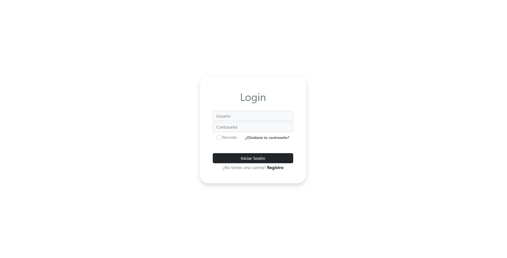

# **Guia de instalación de Bootstrap**

## **Paso 1: Descargar Bootstrap**
Para descargar Bootstrap, puede hacer lo siguiente:

1. Visite el sitio web oficial de [Bootstrap](https://getbootstrap.com/)
2. Haga clic en el botón "Download" en la parte superior de la página
3. Seleccione la versión que desea descargar y haga clic en el botón "Download"

Alternativamente, también puede utilizar un CDN para cargar Bootstrap en su sitio web sin necesidad de descargar los archivos. Por ejemplo, puede utilizar el siguiente código para cargar Bootstrap desde un CDN de Google:

```
<link rel="stylesheet" href="https://stackpath.bootstrapcdn.com/bootstrap/4.3.1/css/bootstrap.min.css">
<script src="https://stackpath.bootstrapcdn.com/bootstrap/4.3.1/js/bootstrap.min.js"></script>

```

## **Paso 2: Incluir los archivos de Bootstrap en un proyecto**
Una vez que haya descargado Bootstrap o lo haya cargado desde un CDN, puede incluir los archivos en su proyecto de varias maneras. Por ejemplo, puede hacer lo siguiente:

1. Copiar los archivos descargados en su proyecto y referenciarlos en su HTML/CSS/JavaScript. Por ejemplo:

```
<link rel="stylesheet" href="path/to/bootstrap.min.css">
<script src="path/to/bootstrap.min.js"></script>
```

2. Utilizar un paquete de gestión de dependencias como npm o Yarn para instalar Bootstrap y luego importarlo en su proyecto. Por ejemplo:
```
npm install bootstrap
```

```
import 'bootstrap/dist/css/bootstrap.min.css';
import 'bootstrap/dist/js/bootstrap.min.js';
```

## **Paso 3: Utilizar Bootstrap en su proyecto**
Una vez que haya incluido los archivos de Bootstrap en su proyecto, puede comenzar a utilizar las clases y componentes de Bootstrap en su HTML/CSS/JavaScript. Por ejemplo, puede utilizar la clase "container" para crear un contenedor con un ancho fijo y centrado horizontalmente:

```
<div class="container">
  <!-- Contenido aquí -->
</div>
```

O puede utilizar el componente "navbar" para crear una barra de navegación:
```
<nav class="navbar navbar-expand-lg navbar-light bg-light">
  <a class="navbar-brand" href="#">Mi sitio web</a>
  <button class="navbar-toggler" type="button" data-toggle="collapse" data-target="#navbarNav" aria-controls="navbarNav" aria-expanded="false" aria-label="Toggle navigation">
    <span class="navbar-toggler-icon"></span>
  </button>
  <div class="collapse navbar-collapse" id="navbarNav">
    <ul class="navbar-nav">
      <li class="nav-item active">
        <a class="nav-link" href="#">Inicio</a>
      </li>
      <li class="nav-item">
        <a class="nav-link" href="#">Acerca de</a>
      </li>
      <li class="nav-item">
        <a class="nav-link" href="#">Contacto</a>
      </li>
    </ul>
  </div>
</nav>
```

## **Login**
<p align="center">	<!-- (optional) center align -->
    
</p>